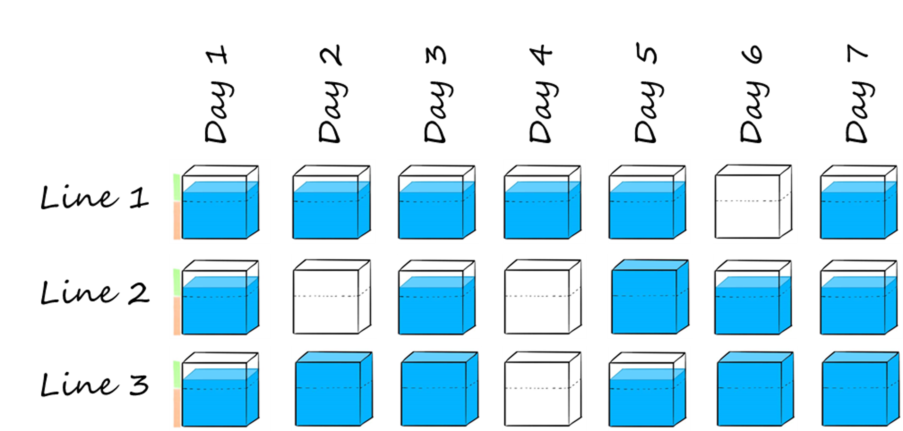

### Learn how to solve optimization problems using Python and the mathematical solver Gurobi

> Even in 2020, many manufacturing companies are still manually doing their production planning, leading to a needless increase in direct costs. Let us see together how we can use Python and Gurobi optimization solver to reduce these costs.

# Context
You are the proud owner of a manufacturing company and own three production lines. On each of these lines, you can produce the same products, but unfortunately, each line is designed differently, and the hourly labor cost varies for each line. You want to be able to make the best use of your equipment to be the most cost-efficient.

# Problem statement
As explained above, your factory possesses three production lines. The hourly labor cost is 245$/h for lines 1 and 3 and 315$/h for line 2. Due to the current rules and regulations, you have some constraints on the daily working hours: one line cannot run for less than 7 hours or more than 12 hours per day.
The requirement from your customer is the number of hours of production for each day of a week, and you want to schedule these hours on the day it is required, meaning no early or late planning.
Let us dive into it and see how we can use Gurobi solver to answer this problem.

<figcaption>Illustration of the problem </figcaption>

# A simple model for planning optimization
## Creation of the inputs
The first step is to define the data that will be used for our problem, described in the problem statement. We will create some dictionaries and pandas data frame as below with the information related to customer need through the week, the timeline on which we are optimizing our planning, the list of productions lines available with the hourly cost associated.

## Initiate the model and create the variables
We now have all the inputs defined; let us build our model. We need to initialize it and create all the variables that will be used within our function.
We will use type hints to have cleaner code and make sure the type of our variables is correct. The input for our function is the timeline on which we want to achieve our planning, the list of available work centers, the requirement for each day and the hourly cost of each work center.

Let us initiate our model and create the decision variables. We add with addVars() our variables and in the attributes set the size, boundaries and type for each variable.

- ***working_hours***: an integer variable indexed by work center for each day within our scope. Boundaries are set to 7 for the lower bound and 12 for the upper bound to respect the rules and regulations of your company.
- ***line_opening***: a binary variable representing the status of each production line for each day, it takes the value 0 if the line is closed and 1 if the line is running.
- ***total_hours***: an integer variable indexed by days and work center; it is the actual value of opening hours for each line.
- ***labor_cost***: an integer value measuring the daily labor cost for each line.

<figcaption>Illustration of our total_hours variables </figcaption>

<html>
<head>

</head>
<body>