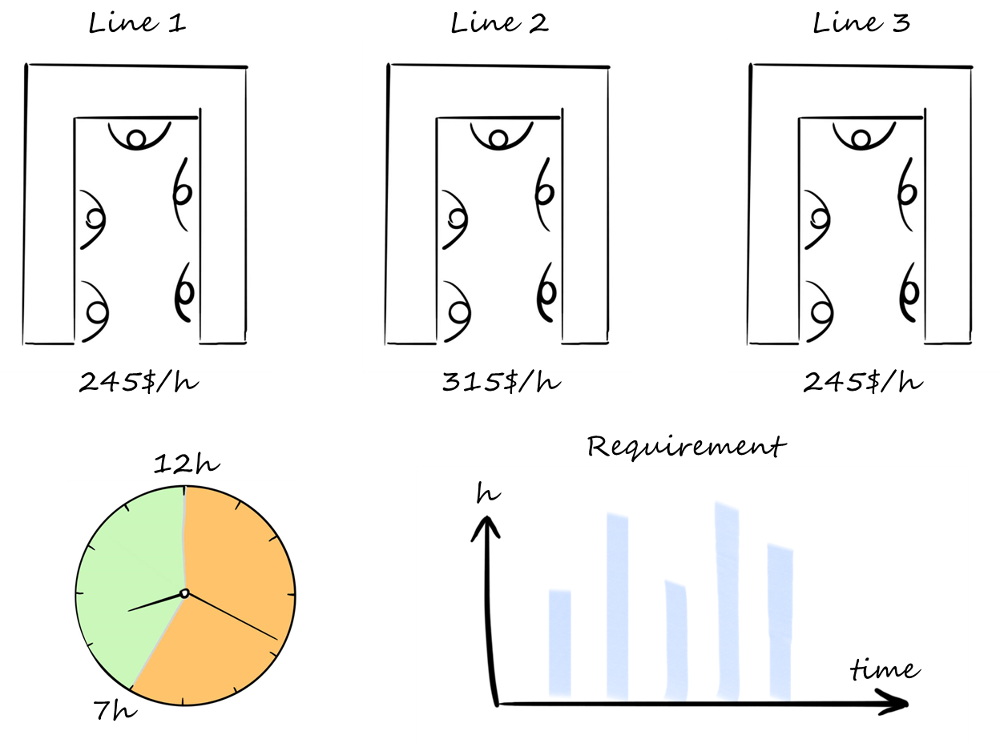
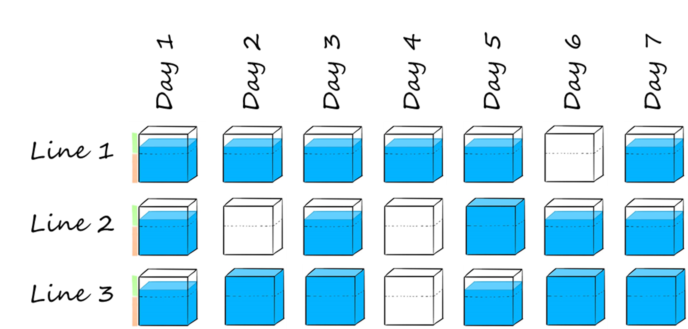

#### Learn how to solve optimization problems using Python and the mathematical solver Gurobi

> Even in 2020, many manufacturing companies are still manually doing their production planning, leading to a needless increase in direct costs. Let us see together how we can use Python and Gurobi optimization solver to reduce these costs.

# Context
You are the proud owner of a manufacturing company and own three production lines. On each of these lines, you can produce the same products, but unfortunately, each line is designed differently, and the hourly labor cost varies for each line. You want to be able to make the best use of your equipment to be the most cost-efficient.

# Problem statement
As explained above, your factory possesses three production lines. The hourly labor cost is 245$/h for lines 1 and 3 and 315$/h for line 2. Due to the current rules and regulations, you have some constraints on the daily working hours: one line cannot run for less than 7 hours or more than 12 hours per day.
The requirement from your customer is the number of hours of production for each day of a week, and you want to schedule these hours on the day it is required, meaning no early or late planning.
Let us dive into it and see how we can use Gurobi solver to answer this problem.

<figcaption>Illustration of the problem </figcaption>

# A simple model for planning optimization
### Creation of the inputs
The first step is to define the data that will be used for our problem, described in the problem statement. We will create some dictionaries and pandas data frame as below with the information related to customer need through the week, the timeline on which we are optimizing our planning, the list of productions lines available with the hourly cost associated.

### Initiate the model and create the variables
We now have all the inputs defined; let us build our model. We need to initialize it and create all the variables that will be used within our function.
We will use type hints to have cleaner code and make sure the type of our variables is correct. The input for our function is the timeline on which we want to achieve our planning, the list of available work centers, the requirement for each day and the hourly cost of each work center.
Let us initiate our model and create the decision variables. We add with addVars() our variables and in the attributes set the size, boundaries and type for each variable.

- ***working_hours***: an integer variable indexed by work center for each day within our scope. Boundaries are set to 7 for the lower bound and 12 for the upper bound to respect the rules and regulations of your company.
- ***line_opening***: a binary variable representing the status of each production line for each day, it takes the value 0 if the line is closed and 1 if the line is running.
- ***total_hours***: an integer variable indexed by days and work center; it is the actual value of opening hours for each line.
- ***labor_cost***: an integer value measuring the daily labor cost for each line.

<figcaption>Illustration of our total_hours variables </figcaption>

For now, we have just created each variable without specifying any relationships. Some variables are linked to each other, and we now must create some constraints to set their value.

### Set up the constraints
Similarly, let’s create our constraints with addConstrs(). If you want to create only one constraint, you should use addConstr() without “s”, but in this case, we are creating multiple constraints for each day and each production line.
First, we need to link the variables previously created. The value of total hours is the product of working hours and line opening, and the value of labor cost is the product of total hours and the hourly cost of each work center contained in wc_reg_cost.
Everything is now set up to run our model. Before solving it, we need to create one last constraint coming from our agreement with the customer. Indeed, as mentioned before, each daily requirement must be satisfied on the same day. That can be translated as follow:

As the model is fully established, we can now define our objective function and solve it.

### Create objective function and solution
Even though all of this is very interesting, let us not forget our target : we want to minimize our labor cost by better balancing the workload on our 3 production lines. This is our objective function!

Now the model we just finished can be solved and will provide us the most cost-efficient planning.
You can use the following code to visualize your model, see all your variables, constraints and the objective function, it can be helpful to correct the mistakes and review if the model is the one intended.
Of course, here, our model is correct, and we can run it directly. We can extract the solution and shape it as needed.

### Visualize the solution
We now came out with the best production planning to meet our customer’s requirements; we need to extract and make it more visual. For this, we will use Altair library for its intuitive interface and for the design of the graphs we can easily create. As it is not the purpose of this article, I will not detail how I did this step, but you can find it on my [GitHub](https://github.com/baptistesoulard/Production-plan-optimization/tree/master/Planning_optimization_part1) and contact me if you need any explanation.

<html>
<head>
  
  
  
  
</head>
<body>
  

  
</body>
</html>

As expected, our production plan is optimized when the lines 1 and 3 are loaded at maximum capacity before opening line 2, as the hourly cost is higher on this line. We can see that the boundaries are respected, and we do not open a line for less than 7 hours or more than 12 hours per day. More importantly, the customer’s request is respected, and the daily requirement is satisfied on the same day, neither in advance nor late.

# Limitation and next steps
This first model was the first approach to production planning optimization with Gurobi solver and presented many limitations. Indeed, we did not consider extra costs due to overtime or weekend work. Also, the requirement may not allow us to produce it on the same day; for example, if it is less than 7 hours, we cannot open the line. That is why we will add more constraints to consider this in the second part, and we will compare the results.
Feel free to contact me if you need further information or if you want to exchange views on this subject. You can reach me on [LinkedIn](https://www.linkedin.com/in/baptistesoulard1994/).

# Resources
The repository of this project on my GitHub : [Link](https://github.com/soulabat/Production-plan-optimization/tree/master/Planning_optimization_part1)  
Explanation of how SAP is using linear optimization in its modules for planning optimization: [Link](http://www.gurobi.com/pdfs/user-events/2017-frankfurt/SAP.pdf>)  
Gurobi documentation: [Link](https://www.gurobi.com/documentation/8.0/examples/workforce5_py.html)

<html>
<head>

</head>
<body>