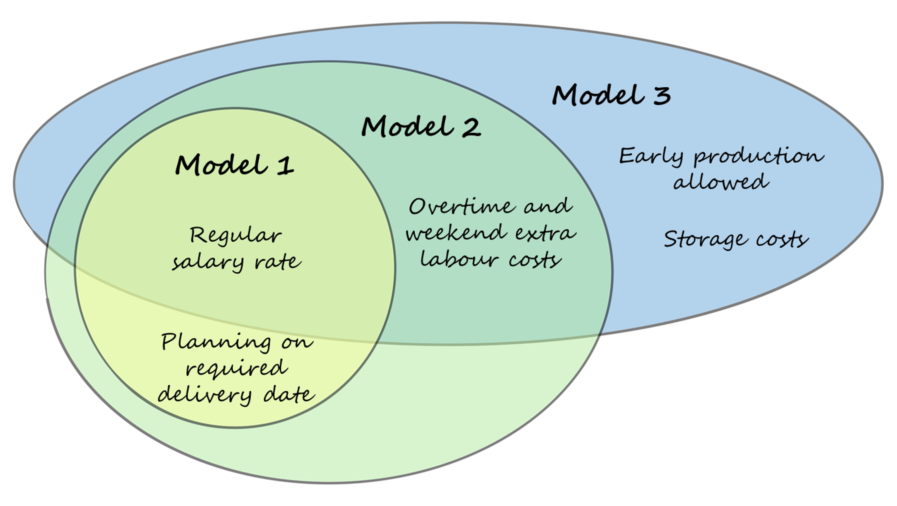
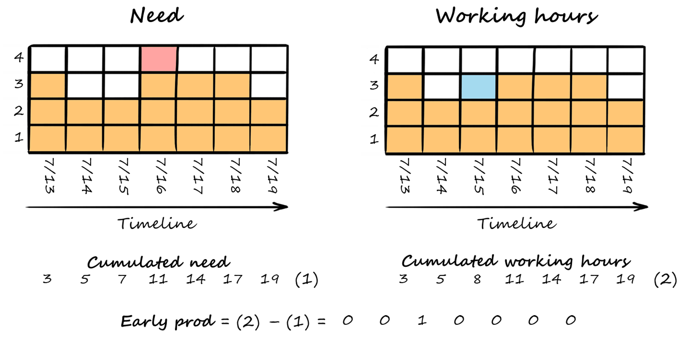
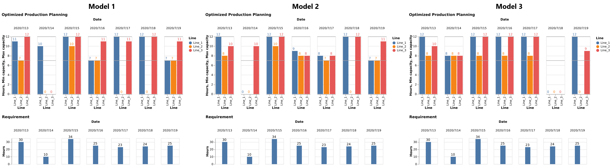

#### Learn how to solve optimization problems using Python and the mathematical solver Gurobi

> This article is the second of a series about the optimization of a production plan, it supplements the first one by adding more constraints in order to be more representative of a real case. The objective remains the same: optimize a production plan to reduce direct costs.
For a better understanding, I highly advise you to read the first [article](https://towardsdatascience.com/optimization-of-a-weekly-production-plan-with-python-and-gurobi-part-1-d1257ad29a9) of this series.

# Context
In the first article, we learned how to use Python and the mathematical solver Gurobi to solve a fundamental optimization problem. We saw how to use these tools to schedule a daily requirement, coming from our customer orders, between several production lines in an optimized way to reduce the labour costs.
Now, we will see how we can complexify the problem to make it more realistic. Indeed, the model we developed in the first article is limited mainly due to the following two points:
* We did not consider extra labour costs during weekends and overtime hours.
* We limited the opening time of a production line to a minimum of 7h and to a maximum of 12h. It is therefore not possible to solve our model if the need does not fall within this range (for example if the daily requirement is 3 hours).
In the following parts, we will see how to adapt our first model to deal with these limitations. We will not review all the code in detail but only show the changes made to the first model. You can find the full code on my [GitHub](https://github.com/baptistesoulard/Production-plan-optimization/tree/master/Planning_optimization_part2).

<figcaption>Different considerations for each model </figcaption>

# Part 1: Let’s add overtime and weekend extra costs to our model
As in the first article, we possess 3 production lines that can run from 7h to 12h per day and we will see how to optimize the production planning to reduce the direct costs. The next image is a reminder of our context:

<figcaption>Illustration of the problem</figcaption>

In real life, it is not possible to set operators working time without any limitation. Indeed, the workforce does not work overtime for free, and we need to consider these extra costs in our model.
For example, it can be more cost-efficient to open three production lines on regular working time than working overtime on two production lines. To consider this new constraint, this time, we are assuming that up to 8 hours per day our operators are paid at a regular rate whereas overtime hours are paid 50% higher. Also, while working during the weekend, the operators are paid twice the regular rate.

### Inputs
As explained above, the hourly cost is different during regular working hours, overtime hours, and during the weekend. Let’s set up these new labour costs with a coefficient of 1.5 for overtime hours and 2 for weekend hours:

### Variables
The only difference with our previous set of variables is that the ***total working hours*** variable is built based on two elements: ***regular hours*** and ***overtime hours***. Let’s create these variables with ***addVars*** and set their boundaries as mentioned in the context presentation.

As the labour cost is different during the weekend, we need to split our timeline into two lists, one for the weekdays and one for the weekend. We will later iterate the constraints on these two lists separately.

### Constraints
As for the constraints, we need to link regular hours and overtime hours with the total hours, for each work center and each day with addConstrs.

Finally, the value of labour cost has changed to take into consideration the new variables. It is calculated separately for weekdays and weekends following the rules explained at the beginning of this article.

 

We have now added all the new constraints and we can solve our model.

### Visualization

<html>
<head>
  
  
  
  
</head>
<body>
  

  
</body>
</html>

As opposed to the first model, this planning does not maximize the hours worked on lines 1 and 2 (the less expensive ones) but tends to reduce the overtime work.
You can observe that this is not the case for the weekend. This is because the concept of overtime extra cost does not exist during this period, the cost is double compared to the regular labour cost but is constant throughout the day.

---

# Part 2: Let’s now allow early production and add inventory costs to our model
Even though the previous models are very satisfying, they are subject to a major limitation! It is not possible to plan manufacturing on a day different day the required delivery date, possibly leading to many unsolvable situations.

Apart from this point, our direct costs can also be reduced by leveling the production over our timeline and that is not allowed in our previous models.

To solve this issue, we will now allow early production. However, early production comes with storage costs, we need to control it.

### Inputs
Most of the inputs remain the same, however, a new direct cost is generated: the carrying costs. Carrying costs include all the expenses generated to an organization due to the inventory carried. It includes capital cost, storage costs, and risk costs. Actual carrying costs can vary a lot, depending on your location, the type of products you produce, and many other factors. However, according to APICS, it is often estimated between 20% and 30% for manufacturing industries. (1)

In our problem, we are working with hours of production. The unitary carrying costs we need to use is an estimation of the carrying cost of one hour of production stored for one day. We can consider that it is equal to 20–30% of the average inventory produced in one hour. Let’s set it to 25$ for our example.

### Variables
As it is possible to plan before the required delivery date, we need to know the quantity produced in advance. Let’s create the variable, we will set its value later.

To get the number of working hours planned before the required delivery date, we will calculate the difference between the cumulated need and the cumulated planned working hours, from the first day to the last one. The sum of this matrix is the number of working hours planned one day before the need. We will later multiply this value by the storage cost per unit to know our total extra costs generated by early planning.

Here is an illustration of the calculation of this variable:

<figcaption>Illustration of early production calculation</figcaption>

In this example, we can see that one hour of production has been planned one day in advance (the blue square). It is what we can find when calculating the early production with our logic. Here are the formulas that are used for our model:

*For k in timeline:*

*By subtracting (1) to (2):*
   

Now that we understand how to calculate the value of early production, we can create a constraint to set its value.

### Constraints
In the previous models, we have set some constraints to force the planning on the required delivery date. This time, we will remove this constraint as we want to allow early planning. However, as customer satisfaction is our number one priority, we want to prevent late planning. To do so, the easiest way is simply to limit the lower bound of our ***early production**** variable to zero.

This had already been done when defining the variable, we can just remove the constraints set for the previous models regarding on-time scheduling.

### Objective function
Our objective is still the same, reduce directs costs. However, this time, our direct cost contains a component for carrying costs that we need to add to the objective function. These costs are calculated by multiplying the unitary carrying cost with early ***production***.

### Visualization

<html>
<head>
  
  
  
  
</head>
<body>
  

  
</body>
</html>

This time, we can observe that our solution tends to level the production during the week and to minimize overtime hours and even more the working hours during the weekend. Indeed, the weekend working hours are the most expensive, twice as expensive as normal working hours. However, as we consider storage costs, early production is minimized.

---
# Comparison of the three models

<figcaption>Comparison of the 3 models</figcaption>

Finally, these three optimizations models gave us different results. The output of the two first models is erroneous because we did not inform our algorithm of the extra costs and we did not allow early planning. The cost of the planning proposed by these two first models is about 5000$ higher than the one proposed by the third model.

**To conclude, it is an absolute necessity to build extensive models considering all of the constraints happening in real life to draw meaningful conclusions with your optimization algorithms.**

Feel free to contact me if you need further information or if you want to exchange views on this subject. You can reach me on [LinkedIn](https://www.linkedin.com/in/baptistesoulard1994/).

# Resources
Find this article on Towards data science: [Link](https://towardsdatascience.com/optimization-of-a-weekly-production-plan-with-python-and-gurobi-part2-6ebcefe85e52)  
The repository of this project on my GitHub: [Link](https://github.com/soulabat/Production-plan-optimization/tree/master/Planning_optimization_part2)  
Explanation of how SAP is using linear optimization in its modules for planning optimization: [Link](http://www.gurobi.com/pdfs/user-events/2017-frankfurt/SAP.pdf>)  
Gurobi documentation: [Link](https://www.gurobi.com/documentation/8.0/examples/workforce5_py.html)

<html>
<head>

</head>
<body>